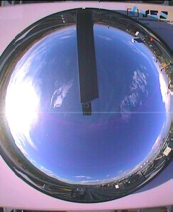
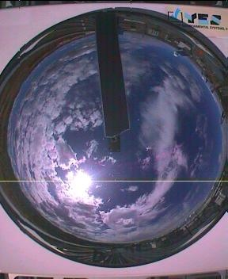

### GFG EcoTech DS Hackathon: Cloud Coverage Calculator using Sky-Cam Images

#### Domain: Computer Vision | Regression | Image Processing

#### Workflow: CLIP + CatBoost

#### Low Cloud Coverage (Range: 0% - 33%)

#### Moderate Cloud Coverage (Range: 33% - 66%)

#### High Cloud Coverage (Range: 66% - 100%)

